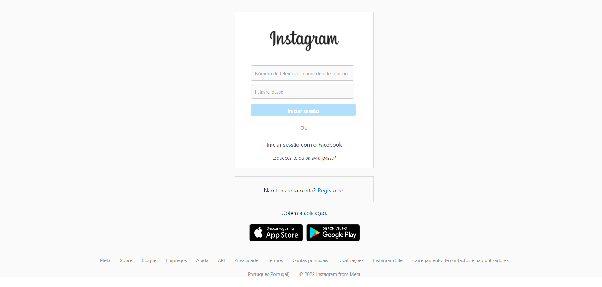

<h1 align="center"> { Página de login Instagram } </h1>

 Reconstrução da interface de login do Instagram WEB

 <a href="#recursos">Recursos</a> •
  <a href="#objetivo">Objetivo</a> •
 <a href="#tecnologias">Tecnologias</a> • 
 <a href="#status">Status</a> • 
 <a href=#imagens"> Imagens </a> • 

### Status

<h4 align="center"> 
	🚧  React 🚀 Em construção...  🚧
</h4>

### Pré-requisitos

Para rodar na máquina, é necessário as seguintes ferramentas: 
[Git](https://git-scm.com), [React](https://pt-br.reactjs.org/). 
Como também um excelente editor de códigos:  [VSCode](https://code.visualstudio.com/)

### Recursos

- [x] Interface Front-END da página de login;
- [ ] Interface Front-END da página de cadastro;
- [ ] Conexão com Banco de Dados;
- [ ] Back-End

### 🛠 Tecnologias

As seguintes ferramentas foram usadas na construção do projeto:

- [React](https://pt-br.reactjs.org/)
- [Styled Componnents](https://styled-components.com/)

### Objetivo

Refazer as funcionalidades da página de login e cadastro do Instagram WEB, como: 
 
Login na conta, criação de conta e métodos de recuperação

### Imagens

